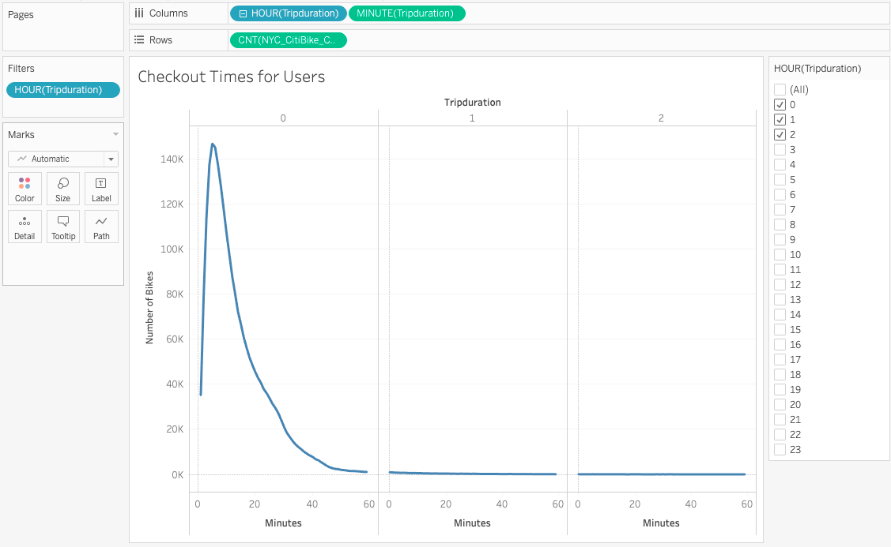

# BikeSharing
Module 14 - Tableau

## **Overview of the Analysis**
The purpose of this analysis is to provide potential investors with a business case for opening a bike-sharing program in Des Moines, Iowa. This project provides a bike trip analysis to provide investors with the day to day and ridership information they have requested.

## **Results**
Our hypothesis is that while New York has a greater tourist industry than Des Moines, the data shows that most of the users of the bike-sharing program are local subscribers using the program for day to day activities and commuting.

</img>

### *August Peak Hours*
The above visualization illustrates that the peak bike-sharing hours in New York are between 7am-10am and 4pm-7pm. This suggests that the core ridership is sustained by commuters using the bike-sharing service to get to and from work or school and/or errands afterward.

</img>

### *Top Ending Locations* 

The top destinations are where there is a high density of urban amenities (such as offices, shopping, etc), supporting the  proposal that many of the users are utilizing the program for their daily commute and activities.

</img>

### *Checkout Times for Users*
The highest number of bikes are checked out for 5-6 mins and few users check the bikes out for more than an hour. The curve in the data shows users of all genders using the bike sharing service most frequently for 0-28 mins. This supports our hypothesis that users are signing out bikes for short trips "here and there".

</img>

### *Checkout Times by Gender*
Our primary audience appears to be male; however, all genders use the service mostly for trips under an hour. The highest number of bikes used are for trips of five minutes. For trips longer than an hour, all genders use the service equally.

</img>

### *Trips by Weekday per Hour*
This heatmap supports that Monday through Friday, the peak user times are during work commute hours. Weekends, particularly Saturday, are more steadily busy throughout the afternoon.

</img>

### *Trips by Gender(Weekday per Hour)*
This worksheet builds on the previous illustration but segregates the data based on gender. We can see that there are more males using the service, but all genders follow the same pattern, with "unknown" making more weekend trips.

</img>

### *User Trips by Gender by Weekday*
There are more subscribers (regular users) to this model (likely not tourists). Males are utilizing the service the most and the busiest days for subscribers are Monday/Tuesday and Thursday/Friday. Customers (non-members) use the service more on weekends.

### ***Tableau Story Attachment***
[link to dashboard](https://public.tableau.com/profile/stephanie.m.juniper#!/vizhome/NYC_CitiBike_Challenge_16124924068370/CheckoutTimesbyGender?publish=yes)

## **Summary**

Overall the bike trip analysis data supports the hypothesis that the bike sharing business is solidly founded on regular users within the city. This is based on the results we found that subscribers are using the service during commuter time periods(mornings and evenings) and are using the service for shorter trips.

Two additional visualizations that would be useful to complete with this data set are:

1. Frequency of trips per user type
2. Age and Frequency of trips

The next steps for this study would be to compare the demographic data between Des Moines and New York. Is the population similar in regards to urban density, traffic and bike commute times? Age demographics between the two cities? Does the population also live in small settings where bike storage may not be an option? Another point of interest is price differences/use threshold required for subscription service to be worthwhile; are there likely to be tourists who are staying for a few days or longer who would purchase a subscription?

Based on this study it appears that a bikesharing program would be a worthwhile investment if the above considerations are utilized.

